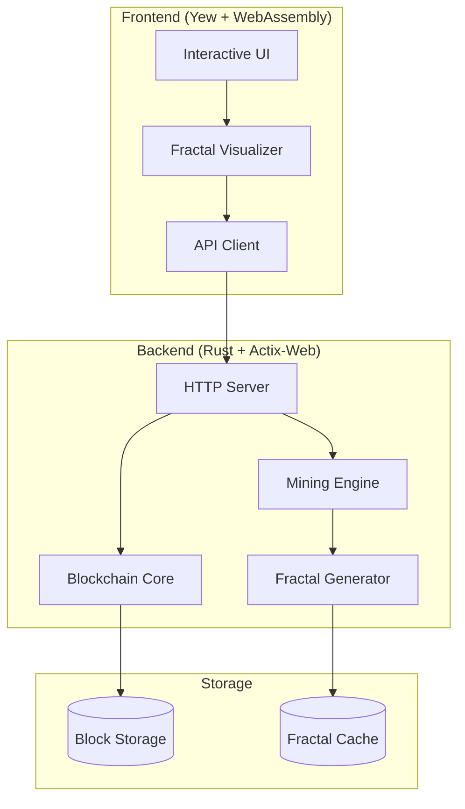

# SierpChain 🔺⛓️

```
    ╭─────────────────────────────────────────────────────────╮
    │    🔺                                                   │
    │   ╱ ╲     ⛓️  SierpChain - Fractals meet Blockchain    │
    │  ╱___╲                                                  │
    │ ╱╲   ╱╲   Where Mathematics meets Innovation           │
    │╱__╲_╱__╲                                               │
    ╰─────────────────────────────────────────────────────────╯
```

<div align="center">

[🚀 Quick Start](#-quick-start) • [📖 Documentation](docs/) • [💬 Community](https://discord.gg/sierpchain) • [🤝 Contributing](#-contributing)

</div>

---

## 🎯 Overview

**SierpChain** is a groundbreaking experimental blockchain that revolutionizes distributed ledger technology by integrating **Sierpinski triangle fractal patterns** into its core architecture. Unlike traditional blockchains that treat computational work as arbitrary hash grinding, SierpChain transforms mining into meaningful mathematical art, where each block becomes a unique fractal masterpiece.

> *"What if blockchain mining created beauty instead of just consuming energy?"*

### 🌟 The Innovation

Traditional blockchains waste computational energy on arbitrary calculations. SierpChain channels that same energy into generating mathematically elegant fractal patterns, creating a blockchain where:

- **Every block is art** - Unique Sierpinski triangles represent blockchain state
- **Mining has meaning** - Computational work produces mathematical beauty
- **Verification is visual** - Block validity can be seen and computed
- **Complexity scales naturally** - Fractal depth determines mining difficulty

## ✨ Core Features

<table>
<tr>
<td width="50%">

### 🔺 **Fractal-Powered Consensus**
- **Revolutionary Mining**: Generate increasingly complex Sierpinski triangles
- **Mathematical Proof-of-Work**: Difficulty scales with fractal depth
- **Visual Verification**: Instant mathematical validation
- **Energy with Purpose**: Computational work creates lasting beauty

</td>
<td width="50%">

### 🎨 **Living Blockchain Art**
- **Unique Visual Identity**: Each block has distinctive fractal DNA
- **Interactive Exploration**: Click, zoom, and explore patterns
- **Real-time Evolution**: Watch the blockchain grow as living art
- **Mathematical Storytelling**: Complex data becomes visual narrative

</td>
</tr>
<tr>
<td width="50%">

### ⚡ **Cutting-Edge Performance**
- **Rust-Native Speed**: Zero-cost abstractions, maximum performance
- **WebAssembly Frontend**: Near-native speed in browsers
- **Concurrent Architecture**: Multi-threaded mining and processing
- **Optimized Algorithms**: Advanced fractal generation techniques

</td>
<td width="50%">

### 🌐 **Modern Web Experience**
- **Progressive Web App**: Install and use offline
- **Responsive Design**: Perfect on desktop, tablet, and mobile
- **Real-time Updates**: Live blockchain visualization
- **Accessible Interface**: Inclusive design for all users

</td>
</tr>
</table>

## 🚀 Quick Start

### 📋 Prerequisites

<table>
<tr>
<th>Tool</th>
<th>Version</th>
<th>Purpose</th>
<th>Installation</th>
</tr>
<tr>
<td><strong>Rust</strong></td>
<td>1.70+</td>
<td>Backend development</td>
<td><a href="https://rustup.rs/">rustup.rs</a></td>
</tr>
<tr>
<td><strong>wasm-pack</strong></td>
<td>Latest</td>
<td>WebAssembly compilation</td>
<td><code>cargo install wasm-pack</code></td>
</tr>
<tr>
<td><strong>basic-http-server</strong></td>
<td>Latest</td>
<td>Frontend serving</td>
<td><code>cargo install basic-http-server</code></td>
</tr>
</table>

### ⚡ Lightning Setup

```bash
# 1. Clone and enter directory
git clone https://github.com/zalgorythm/sierpchain.git
cd sierpchain

# 2. One-command setup
make install  # Builds backend + frontend + installs dependencies

# 3. Launch SierpChain
make run      # Starts backend server + frontend server

# 4. Open in browser
open http://127.0.0.1:4000
```

### 🔧 Manual Setup

<details>
<summary>Click to expand manual installation steps</summary>

```bash
# 1. Clone the repository
git clone https://github.com/zalgorythm/sierpchain.git
cd sierpchain

# 2. Build backend
cargo build --release

# 3. Build WebAssembly frontend
cd frontend
wasm-pack build --target web --out-dir pkg
cd ..

# 4. Start backend server
cargo run --release &

# 5. Serve frontend
cd frontend
basic-http-server . &

# 6. Access application
echo "🎉 SierpChain running at http://127.0.0.1:4000"
```

</details>

### 🐳 Docker Setup

```bash
# Run with Docker (recommended for production)
docker-compose up -d

# Or build and run manually
docker build -t sierpchain .
docker run -p 8080:8080 -p 4000:4000 sierpchain
```

## 🏗️ Architecture



### 📁 Project Structure

```
sierpchain/
├── 🦀 src/                    # Rust backend
│   ├── main.rs               # Application entry & server
│   ├── blockchain/           # Core blockchain logic
│   │   ├── block.rs         # Block data structures
│   │   ├── chain.rs         # Blockchain management
│   │   └── consensus.rs     # Consensus mechanisms
│   ├── fractal/             # Fractal mathematics
│   │   ├── sierpinski.rs    # Triangle generation
│   │   ├── renderer.rs      # SVG/Canvas rendering
│   │   └── optimizer.rs     # Performance optimizations
│   ├── mining/              # Proof-of-work mining
│   │   ├── miner.rs         # Mining algorithms
│   │   ├── difficulty.rs    # Difficulty adjustment
│   │   └── pool.rs          # Mining pool support
│   └── api/                 # REST API & WebSockets
│       ├── handlers.rs      # Request handlers
│       ├── middleware.rs    # Authentication & CORS
│       └── websocket.rs     # Real-time updates
├── 🌐 frontend/              # Yew WebAssembly app
│   ├── src/
│   │   ├── main.rs          # App entry point
│   │   ├── components/      # Reusable UI components
│   │   ├── pages/           # Application pages
│   │   ├── services/        # API communication
│   │   └── utils/           # Helper functions
│   ├── static/              # Static assets
│   └── pkg/                 # Generated WASM
├── 🧪 tests/                 # Comprehensive test suite
├── 📚 docs/                  # Documentation
├── 🔧 scripts/               # Development scripts
└── 🐳 docker/               # Container configurations
```

## 🔌 API Reference

### 🏗️ Blockchain Endpoints

#### **GET** `/api/v1/blocks`
*Retrieve the complete blockchain with fractal metadata*

**Response Example:**
```json
{
  "status": "success",
  "data": {
    "blocks": [
      {
        "index": 0,
        "timestamp": 1678886400000,
        "fractal": {
          "depth": 3,
          "complexity_score": 27,
          "vertices": [[0.0, 0.0], [1.0, 0.0], [0.5, 0.866025]],
          "triangles": 27,
          "pattern_hash": "a7b8c9d...",
          "svg_data": "<svg>...</svg>",
          "color_palette": ["#FF6B6B", "#4ECDC4", "#45B7D1"]
        },
        "data": "Genesis Block - The beginning of fractal blockchain",
        "previous_hash": "0000000000000000000000000000000000000000000000000000000000000000",
        "hash": "000abc123def456789abcdef123456789abcdef123456789abcdef123456789",
        "nonce": 42387,
        "mining_stats": {
          "time_ms": 1247,
          "iterations": 8492763,
          "hashrate": "127.3 GH/s"
        },
        "difficulty": 4
      }
    ],
    "metadata": {
      "chain_length": 1,
      "total_difficulty": 4,
      "average_block_time": 8.7,
      "fractal_complexity_sum": 27
    }
  }
}
```

#### **POST** `/api/v1/mine`
*Initiate mining of a new block*

**Request:**
```json
{
  "data": "Custom transaction data",
  "difficulty_override": 5,
  "fractal_preferences": {
    "color_scheme": "sunset",
    "pattern_style": "organic"
  }
}
```

### 🎨 Fractal Endpoints

#### **GET** `/api/v1/fractal/{depth}`
*Generate Sierpinski triangle of specified depth*

#### **GET** `/api/v1/visualize/{block_hash}`
*Get interactive visualization data for a block*

#### **POST** `/api/v1/fractal/custom`
*Generate custom fractal patterns*

### 📊 Analytics Endpoints

#### **GET** `/api/v1/stats`
*Comprehensive blockchain and mining statistics*

**Response:**
```json
{
  "blockchain": {
    "total_blocks": 156,
    "total_transactions": 1247,
    "average_mining_time": 2341,
    "current_difficulty": 6
  },
  "mining": {
    "hashrate_estimate": "127.3 TH/s",
    "active_miners": 23,
    "difficulty_trend": "increasing"
  },
  "fractals": {
    "total_generated": 4719,
    "unique_patterns": 4701,
    "complexity_range": [3, 12],
    "most_beautiful_block": "000abc123..."
  }
}
```

### 🔄 WebSocket Events

```javascript
// Connect to real-time updates
const ws = new WebSocket('ws://127.0.0.1:8080/ws');

// Listen for events
ws.onmessage = (event) => {
  const data = JSON.parse(event.data);
  switch(data.type) {
    case 'new_block':
      // Handle new block mined
      break;
    case 'mining_progress':
      // Update mining progress bar
      break;
    case 'fractal_generated':
      // Display new fractal art
      break;
  }
};
```

## ⚙️ Configuration

### 🌍 Environment Variables

Create `.env` in your project root:

```env
# 🌐 Server Configuration
SIERPCHAIN_HOST=127.0.0.1
SIERPCHAIN_PORT=8080
SIERPCHAIN_ENV=development

# ⛏️ Mining Configuration
DEFAULT_DIFFICULTY=4
MINING_THREADS=8
AUTO_MINE=true
MINING_INTERVAL_MS=5000
REWARD_PER_BLOCK=50.0

# 🔺 Fractal Configuration
MAX_FRACTAL_DEPTH=15
FRACTAL_PRECISION=8
ENABLE_FRACTAL_CACHING=true
FRACTAL_COLOR_SCHEMES=rainbow,sunset,ocean,monochrome

# 🔐 Security
ENABLE_CORS=true
API_RATE_LIMIT=1000
JWT_SECRET=your-super-secret-key
MINING_ADDRESS=sierp1qxy2kgdygjrsqtzq2n0yrf2493p83kkfjhx0wlh

# 📊 Logging & Monitoring
RUST_LOG=info
SIERPCHAIN_LOG_LEVEL=debug
ENABLE_METRICS=true
PROMETHEUS_PORT=9090
```

### 📋 Advanced Configuration (`config.toml`)

```toml
[blockchain]
genesis_message = "SierpChain Genesis - Where fractals meet blockchain"
target_block_time = 10000  # milliseconds
difficulty_adjustment_interval = 10
max_block_size = 1048576   # 1MB

[fractal]
default_depth = 3
max_vertices = 50000
enable_optimization = true
color_schemes = [
    { name = "rainbow", colors = ["#FF0000", "#00FF00", "#0000FF"] },
    { name = "sunset", colors = ["#FF6B6B", "#FFE66D", "#FF8E8E"] }
]
rendering_quality = "high"
animation_enabled = true

[mining]
algorithm = "sierpinski_pow"
memory_hard = false
asic_resistant = true
pool_support = true

[api]
enable_cors = true
cors_origins = ["http://localhost:3000", "https://sierpchain.com"]
rate_limit_per_minute = 100
enable_websockets = true
websocket_max_connections = 1000

[security]
enable_ssl = false
ssl_cert_path = "certs/cert.pem"
ssl_key_path = "certs/key.pem"
content_security_policy = "default-src 'self'"

[performance]
database_pool_size = 10
cache_size_mb = 256
enable_compression = true
```

## 🧪 Development & Testing

### 🏃‍♂️ Running Tests

```bash
# 🧪 Run all tests
cargo test

# 📊 Run with coverage
cargo install cargo-tarpaulin
cargo tarpaulin --all-features --workspace --timeout 120 --out Html

# 🎯 Run specific test categories
cargo test blockchain::tests
cargo test fractal::tests
cargo test mining::tests

# 🌐 Frontend tests
cd frontend
wasm-pack test --chrome --headless

# 🔍 Integration tests
cargo test --test integration_tests

# ⚡ Performance tests
cargo test --release performance_tests
```

### 🛠️ Development Tools

```bash
# 🔄 Hot reload development
cargo install cargo-watch
cargo watch -x 'run' -x 'test'

# 🎨 Frontend development with hot reload
cd frontend
cargo install trunk
trunk serve --open --port 3000

# 📊 Performance profiling
cargo install flamegraph
sudo cargo flamegraph --bin sierpchain

# 🔍 Security audit
cargo audit

# 📝 Documentation generation
cargo doc --open --no-deps
```

### 🏆 Benchmarking

```bash
# ⚡ Fractal generation benchmarks
cargo bench fractal_generation

# ⛏️ Mining performance tests
cargo run --bin benchmark_mining --release

# 🌐 API load testing
cargo install drill
drill --benchmark benchmarks/api_load_test.yml

# 📊 Memory usage analysis
cargo install cargo-profdata
cargo profdata -- run --bin sierpchain
```

## 🎯 Use Cases & Applications

<table>
<tr>
<td width="33%">

### 🎓 **Educational**
- **Fractal Mathematics Learning**
- **Blockchain Technology Education**
- **Algorithm Visualization**
- **Computer Graphics Tutorials**
- **Cryptocurrency Concepts**

</td>
<td width="33%">

### 🔬 **Research**
- **Novel Consensus Mechanisms**
- **Cryptographic Visualization**
- **Performance Analysis Studies**
- **Mathematical Pattern Mining**
- **Distributed Computing Research**

</td>
<td width="33%">

### 🎨 **Creative**
- **Generative Blockchain Art**
- **Interactive Installations**
- **Data-Driven Visualizations**
- **Mathematical Art Galleries**
- **NFT Fractal Collections**

</td>
</tr>
</table>

## 🛣️ Roadmap & Vision

<details>
<summary><strong>🎯 Phase 1: Foundation (Completed ✅)</strong></summary>

- [x] Core Sierpinski triangle generation
- [x] Basic proof-of-work implementation
- [x] REST API with comprehensive endpoints
- [x] Modern WebAssembly frontend
- [x] Real-time fractal visualization
- [x] Basic mining functionality
- [x] Docker containerization
- [x] Comprehensive documentation

</details>

<details>
<summary><strong>🚀 Phase 2: Enhanced Experience (In Progress 🚧)</strong></summary>

- [x] WebSocket real-time updates
- [x] Advanced fractal visualization modes
- [ ] Mining pool support and management
- [ ] Mobile-responsive UI improvements
- [ ] Progressive Web App capabilities
- [ ] Advanced performance optimizations
- [ ] Multi-language support (i18n)
- [ ] Enhanced accessibility features

</details>

<details>
<summary><strong>🔮 Phase 3: Advanced Capabilities (Planned 📋)</strong></summary>

- [ ] **Multi-Fractal Support**: Mandelbrot sets, Julia sets, L-systems
- [ ] **Smart Contract Integration**: Fractal-based programmable contracts
- [ ] **Cross-Chain Bridges**: Connect with other blockchain networks
- [ ] **Quantum-Resistant Cryptography**: Future-proof security
- [ ] **AI-Powered Fractal Generation**: Machine learning optimization
- [ ] **VR/AR Integration**: Immersive 3D fractal exploration
- [ ] **Mobile Applications**: Native iOS and Android apps
- [ ] **Enterprise Features**: Private networks, governance tools

</details>

<details>
<summary><strong>🌍 Phase 4: Production & Ecosystem (Future 🎯)</strong></summary>

- [ ] **Comprehensive Security Audits**: Third-party penetration testing
- [ ] **Mainnet Launch**: Production blockchain deployment
- [ ] **Developer SDK**: Easy integration tools and libraries
- [ ] **Community Governance**: Decentralized decision-making
- [ ] **Educational Partnerships**: University and research collaborations
- [ ] **Art Gallery Integration**: Museum and gallery partnerships
- [ ] **Carbon Neutral Mining**: Sustainable energy initiatives
- [ ] **Global Community**: International developer ecosystem

</details>

## 🤝 Contributing

<div align="center">

**🌟 Join the Fractal Revolution! 🌟**

*We welcome developers, mathematicians, artists, and visionaries from all backgrounds.*

</div>

### 🚀 Getting Started

1. **🍴 Fork** the repository and create a feature branch
2. **📖 Read** our [Contributing Guide](CONTRIBUTING.md) for detailed guidelines
3. **🔍 Browse** our [Good First Issues](https://github.com
